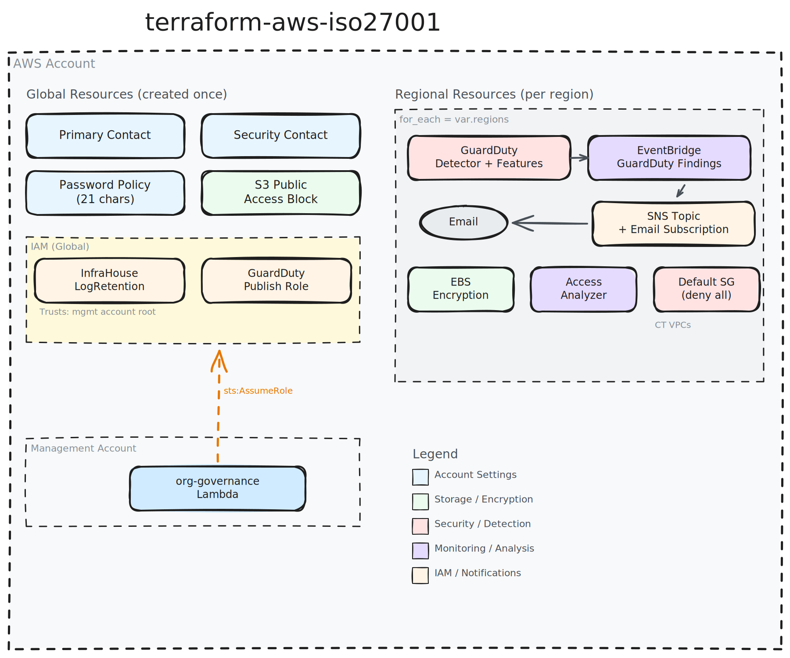

# terraform-aws-iso27001

[](https://infrahouse.com/contact)
[](https://infrahouse.github.io/terraform-aws-iso27001/)
[](https://registry.infrahouse.com/modules/infrahouse/iso27001/aws)
[](https://github.com/infrahouse/terraform-aws-iso27001/releases/latest)
[](https://github.com/infrahouse/terraform-aws-iso27001/actions/workflows/vuln-scanner-pr.yml)
[](LICENSE)

[](https://aws.amazon.com/guardduty/)
[](https://aws.amazon.com/iam/)
[](https://aws.amazon.com/s3/)

A Terraform module that configures AWS account security controls and monitoring
services to support ISO 27001 compliance requirements.

## Architecture



## Why This Module?

Securing an AWS account for ISO 27001 compliance requires configuring dozens of
services across multiple regions. This module applies all essential security
controls in a single deployment:

- **One module, all regions** -- uses AWS provider v6 `region` argument to manage
  multi-region controls from a single module call (no provider aliases needed)
- **Least privilege by design** -- dedicated IAM roles scoped to exactly what's needed
- **Control Tower aware** -- locks down default VPCs and security groups created by
  AWS Control Tower without conflicting with CT-managed resources
- **Opinionated defaults** -- 21-character passwords, EBS encryption everywhere,
  no public S3 buckets, GuardDuty with all features enabled

## Features

- **Account Contacts**: Sets up primary and security contact information
- **GuardDuty**: Enables threat detection with all detector features across all regions,
  and enforces 365-day retention on the malware-scan events log group
- **IAM Access Analyzer**: Monitors external access to your resources in every region
- **Password Policy**: Enforces strong IAM password requirements (21 chars, all character types)
- **EBS Encryption**: Enables encryption by default for all EBS volumes in every region
- **S3 Public Access Block**: Prevents public access to S3 buckets at the account level
- **VPC Security**: Configures default security groups to deny all traffic
- **Log Retention Role**: Creates a least-privilege IAM role for cross-account
  CloudWatch log retention enforcement and log-group tagging (e.g. Vanta
  exclusion of Control Tower-managed groups)

## Quick Start

```hcl
module "iso27001" {
  source  = "registry.infrahouse.com/infrahouse/iso27001/aws"
  version = "2.1.0"

  regions = ["us-east-1", "us-west-2"]

  primary_contact = {
    address_line_1 = "123 Any Street"
    city           = "Seattle"
    company_name   = "Example Corp, Inc."
    country_code   = "US"
    full_name      = "My Name"
    phone_number   = "+64211111111"
    postal_code    = "98101"
    state_or_region = "WA"
  }
  security_contact = {
    full_name    = "Security Team"
    title        = "Security Officer"
    email        = "security@example.com"
    phone_number = "+1234567890"
  }
}
```

## Documentation

- [Getting Started](https://infrahouse.github.io/terraform-aws-iso27001/getting-started/)
- [Architecture](https://infrahouse.github.io/terraform-aws-iso27001/architecture/)
- [Configuration](https://infrahouse.github.io/terraform-aws-iso27001/configuration/)
- [Examples](https://infrahouse.github.io/terraform-aws-iso27001/examples/)
- [Troubleshooting](https://infrahouse.github.io/terraform-aws-iso27001/troubleshooting/)
- [Changelog](https://infrahouse.github.io/terraform-aws-iso27001/changelog/)

## Upgrading to 2.0.0

Version 2.0.0 is a major refactor. See the
[upgrade guide](https://infrahouse.github.io/terraform-aws-iso27001/upgrading/)
for detailed migration instructions.

Key changes:
- **Drops AWS provider v5** -- requires `>= 6.0`
- **Single deployment** -- replaces per-region module instances with a `regions` variable
- **Removes `AWSControlTowerExecution`** -- Control Tower manages this role
- **Inlines GuardDuty** -- no longer depends on `terraform-aws-guardduty-configuration`
- **Adds `InfraHouseLogRetention`** IAM role for cross-account log retention

## Examples

See the [examples/](examples/) directory.

## Contributing

See [CONTRIBUTING.md](CONTRIBUTING.md).

## License

Apache 2.0 -- see [LICENSE](LICENSE).

<!-- BEGIN_TF_DOCS -->

## Requirements

| Name | Version |
|------|---------|
| <a name="requirement_aws"></a> [aws](#requirement\_aws) | >= 6.0, < 7.0 |

## Providers

| Name | Version |
|------|---------|
| <a name="provider_aws"></a> [aws](#provider\_aws) | >= 6.0, < 7.0 |

## Modules

No modules.

## Resources

| Name | Type |
|------|------|
| [aws_accessanalyzer_analyzer.external_access](https://registry.terraform.io/providers/hashicorp/aws/latest/docs/resources/accessanalyzer_analyzer) | resource |
| [aws_account_alternate_contact.security](https://registry.terraform.io/providers/hashicorp/aws/latest/docs/resources/account_alternate_contact) | resource |
| [aws_account_primary_contact.this](https://registry.terraform.io/providers/hashicorp/aws/latest/docs/resources/account_primary_contact) | resource |
| [aws_cloudwatch_event_rule.guardduty_findings](https://registry.terraform.io/providers/hashicorp/aws/latest/docs/resources/cloudwatch_event_rule) | resource |
| [aws_cloudwatch_event_target.guardduty_notify](https://registry.terraform.io/providers/hashicorp/aws/latest/docs/resources/cloudwatch_event_target) | resource |
| [aws_cloudwatch_log_group.malware_scan_events](https://registry.terraform.io/providers/hashicorp/aws/latest/docs/resources/cloudwatch_log_group) | resource |
| [aws_default_security_group.default](https://registry.terraform.io/providers/hashicorp/aws/latest/docs/resources/default_security_group) | resource |
| [aws_ebs_encryption_by_default.this](https://registry.terraform.io/providers/hashicorp/aws/latest/docs/resources/ebs_encryption_by_default) | resource |
| [aws_guardduty_detector.main](https://registry.terraform.io/providers/hashicorp/aws/latest/docs/resources/guardduty_detector) | resource |
| [aws_guardduty_detector_feature.enabled](https://registry.terraform.io/providers/hashicorp/aws/latest/docs/resources/guardduty_detector_feature) | resource |
| [aws_guardduty_detector_feature.runtime_monitoring](https://registry.terraform.io/providers/hashicorp/aws/latest/docs/resources/guardduty_detector_feature) | resource |
| [aws_iam_account_password_policy.strict](https://registry.terraform.io/providers/hashicorp/aws/latest/docs/resources/iam_account_password_policy) | resource |
| [aws_iam_policy.guardduty](https://registry.terraform.io/providers/hashicorp/aws/latest/docs/resources/iam_policy) | resource |
| [aws_iam_role.InfraHouseLogRetention](https://registry.terraform.io/providers/hashicorp/aws/latest/docs/resources/iam_role) | resource |
| [aws_iam_role.guardduty](https://registry.terraform.io/providers/hashicorp/aws/latest/docs/resources/iam_role) | resource |
| [aws_iam_role_policy.InfraHouseLogRetention](https://registry.terraform.io/providers/hashicorp/aws/latest/docs/resources/iam_role_policy) | resource |
| [aws_iam_role_policy_attachment.guardduty](https://registry.terraform.io/providers/hashicorp/aws/latest/docs/resources/iam_role_policy_attachment) | resource |
| [aws_s3_account_public_access_block.current](https://registry.terraform.io/providers/hashicorp/aws/latest/docs/resources/s3_account_public_access_block) | resource |
| [aws_sns_topic.guardduty_notifications](https://registry.terraform.io/providers/hashicorp/aws/latest/docs/resources/sns_topic) | resource |
| [aws_sns_topic_subscription.guardduty_emails](https://registry.terraform.io/providers/hashicorp/aws/latest/docs/resources/sns_topic_subscription) | resource |
| [aws_iam_policy_document.InfraHouseLogRetention-permissions](https://registry.terraform.io/providers/hashicorp/aws/latest/docs/data-sources/iam_policy_document) | data source |
| [aws_iam_policy_document.InfraHouseLogRetention-trust](https://registry.terraform.io/providers/hashicorp/aws/latest/docs/data-sources/iam_policy_document) | data source |
| [aws_iam_policy_document.guardduty_assume](https://registry.terraform.io/providers/hashicorp/aws/latest/docs/data-sources/iam_policy_document) | data source |
| [aws_iam_policy_document.guardduty_permissions](https://registry.terraform.io/providers/hashicorp/aws/latest/docs/data-sources/iam_policy_document) | data source |
| [aws_organizations_organization.current](https://registry.terraform.io/providers/hashicorp/aws/latest/docs/data-sources/organizations_organization) | data source |
| [aws_vpcs.aws_control_tower_vpc](https://registry.terraform.io/providers/hashicorp/aws/latest/docs/data-sources/vpcs) | data source |

## Inputs

| Name | Description | Type | Default | Required |
|------|-------------|------|---------|:--------:|
| <a name="input_guardduty_log_retention_days"></a> [guardduty\_log\_retention\_days](#input\_guardduty\_log\_retention\_days) | Retention (in days) applied to GuardDuty-owned CloudWatch log groups managed<br/>by this module (currently /aws/guardduty/malware-scan-events). Default 365<br/>satisfies the ISO 27001 retention standard. Must be a CloudWatch-Logs-supported<br/>value. | `number` | `365` | no |
| <a name="input_primary_contact"></a> [primary\_contact](#input\_primary\_contact) | Primary contact for the account. | <pre>object(<br/>    {<br/>      address_line_1     = string<br/>      address_line_2     = optional(string, null)<br/>      address_line_3     = optional(string, null)<br/>      city               = string<br/>      company_name       = string<br/>      country_code       = string<br/>      district_or_county = optional(string, null)<br/>      full_name          = string<br/>      phone_number       = string<br/>      postal_code        = string<br/>      state_or_region    = optional(string, null)<br/>      website_url        = optional(string, null)<br/>    }<br/>  )</pre> | n/a | yes |
| <a name="input_regions"></a> [regions](#input\_regions) | List of AWS regions to configure regional ISO 27001 controls in. | `list(string)` | n/a | yes |
| <a name="input_security_contact"></a> [security\_contact](#input\_security\_contact) | Security contact for the account. | <pre>object(<br/>    {<br/>      full_name    = string<br/>      phone_number = string<br/>      title        = string<br/>      email        = string<br/>    }<br/>  )</pre> | n/a | yes |

## Outputs

No outputs.
<!-- END_TF_DOCS -->
