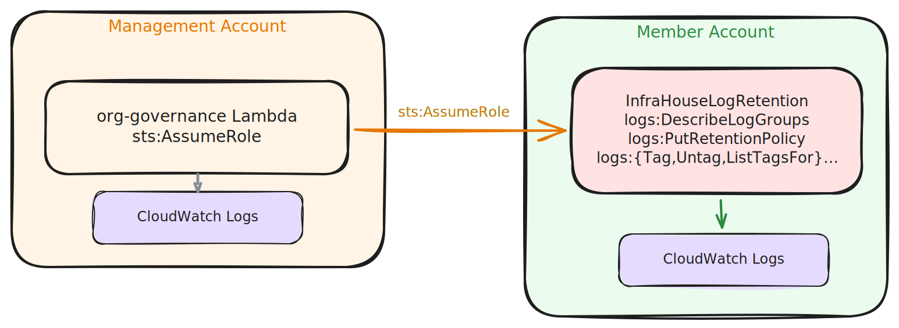

# Architecture


## Resource Classification

The module manages two categories of resources:

### Global Resources (created once)

These are account-level and apply regardless of region:

| Resource | Purpose |
|----------|---------|
| `aws_account_primary_contact` | Account primary contact |
| `aws_account_alternate_contact` | Security contact |
| `aws_iam_account_password_policy` | IAM password policy |
| `aws_s3_account_public_access_block` | Block public S3 access |
| `aws_iam_role` (InfraHouseLogRetention) | Cross-account log retention |
| `aws_iam_role` (guardduty-publish) | EventBridge to SNS for GuardDuty |

### Regional Resources (created per region)

These are deployed in each region specified in `var.regions`:

| Resource | Purpose |
|----------|---------|
| `aws_ebs_encryption_by_default` | EBS encryption |
| `aws_accessanalyzer_analyzer` | IAM Access Analyzer |
| `aws_guardduty_detector` | Threat detection |
| `aws_guardduty_detector_feature` | GuardDuty features |
| `aws_cloudwatch_event_rule` | GuardDuty finding events |
| `aws_sns_topic` | GuardDuty notifications |
| `aws_default_security_group` | Lock down default SGs |

## How Multi-Region Works

The module uses the AWS provider v6 `region` argument on each regional
resource. This allows a single module deployment to manage resources
across multiple regions without provider aliases:

```hcl
resource "aws_ebs_encryption_by_default" "this" {
  for_each = toset(var.regions)
  enabled  = true
  region   = each.key
}
```

## Cross-Account Log Retention

The `InfraHouseLogRetention` IAM role is designed for use with
[terraform-aws-org-governance](https://github.com/infrahouse/terraform-aws-org-governance).
The trust policy allows the management account root to assume it. The
permissions are scoped to `logs:DescribeLogGroups`,
`logs:PutRetentionPolicy`, `logs:ListTagsForResource`, `logs:TagResource`,
and `logs:UntagResource` only — enough to enforce retention policies and to
tag Control Tower-managed log groups (e.g. for Vanta exclusion) without
granting read access to log events. The tagging permissions exist because
Control Tower-managed log groups are blocked from retention changes by the
`GRLOGGROUPPOLICY` SCP, so the org-governance Lambda tags them with
`VantaNoAlert=true` to mark them out of scope for Vanta's retention test.



## Control Tower VPC Handling

The module discovers Control Tower VPCs (tagged `aws-controltower-VPC`) in
each region and locks down their default security groups to deny all traffic.
